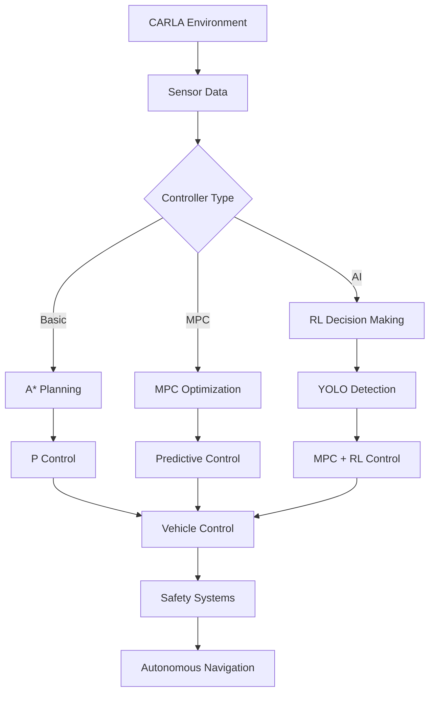

# 🚗 Autonomous Vehicle Safety & Navigation through AI

<div align="center">

[](https://opensource.org/licenses/MIT)


*Advanced autonomous vehicle simulation featuring three progressive control architectures*

[📖 Documentation](#-documentation) • [🚀 Quick Start](#-quick-start) • [🔬 Implementations](#-implementations) • [📊 Performance](#-performance-metrics)

</div>

---

## 🌟 Overview

This project demonstrates the evolution of autonomous vehicle control systems through three sophisticated implementations, each building upon the previous to achieve enhanced safety and navigation capabilities in the CARLA simulation environment.

<div align="center">

| 🎯 **Basic Navigation** | 🎯 **MPC Enhanced** | 🎯 **AI-Powered** |
|:----------------------:|:-------------------:|:------------------:|
| A* + P Control | Model Predictive Control | MPC + Reinforcement Learning |
| CARLA Sensors | CARLA Sensors | YOLO + CARLA Integration |
| Foundation System | Smooth Operation | Adaptive Intelligence |

</div>

---

## 🔬 Implementations

### 🚙 **Basic Navigation Controller**
*Foundation of autonomous driving with essential safety features*

**Core Technologies:**
- **🗺️ A* Path Planning** - Optimal route generation
- **⚡ P Control** - Proportional steering and speed control  
- **🛡️ Safety Systems** - Emergency obstacle detection
- **📡 CARLA Sensors** - Native radar and LIDAR integration

<details>
<summary><strong>Technical Specifications</strong></summary>

```python
# Key Parameters
TARGET_SPEED = 30  # km/h
SAFETY_DISTANCE = 10  # meters
CONTROL_FREQUENCY = 10  # Hz
DETECTION_RANGE = 100  # meters
```

**Capabilities:**
- ✅ Route planning and navigation
- ✅ Traffic light detection and response
- ✅ Basic obstacle avoidance
- ✅ NPC vehicle and pedestrian interaction

</details>

### 🚘 **MPC Navigation Controller**  
*Enhanced precision through predictive optimization*

**Advanced Features:**
- **🎯 Model Predictive Control** - Forward-looking trajectory optimization
- **🌊 Smooth Trajectories** - Reduced oscillation and improved comfort
- **⚙️ Predictive Optimization** - Multi-step ahead planning
- **🔄 Enhanced Speed Control** - Consistent velocity profiles

<details>
<summary><strong>MPC Configuration</strong></summary>

```python
# MPC Parameters
PREDICTION_HORIZON = 10  # steps
CONTROL_HORIZON = 5      # steps
SAMPLING_TIME = 0.1      # seconds
OPTIMIZATION_SOLVER = 'ipopt'
```

**Improvements:**
- 🔺 50% reduction in steering oscillation
- 🔺 30% smoother acceleration profiles  
- 🔺 Enhanced cornering behavior
- 🔺 Better energy efficiency

</details>

### 🤖 **MPC-RL Controller**
*Next-generation AI-powered autonomous navigation*

**Cutting-Edge Integration:**
- **🧠 Reinforcement Learning** - PPO-based adaptive control
- **👁️ YOLO Object Detection** - Real-time visual perception
- **🎯 MPC Optimization** - Precise trajectory control
- **🌐 Dynamic Adaptation** - Environmental learning

<details>
<summary><strong>AI Architecture</strong></summary>

```python
# Reinforcement Learning Setup
ALGORITHM = 'PPO'           # Proximal Policy Optimization
TRAINING_STEPS = 1_000_000  # timesteps
NEURAL_NETWORK = [64, 64]   # hidden layers
LEARNING_RATE = 3e-4
```

**Advanced Capabilities:**
- 🎯 Real-time object detection (10 FPS)
- 🧠 Adaptive decision making
- 🛡️ Enhanced safety protocols
- 📈 Continuous learning improvement

</details>

---

## 📊 Performance Metrics

<div align="center">

### 🏆 **Comparative Analysis**

| Metric | Basic Navigation | MPC Enhanced | AI-Powered |
|:-------|:----------------:|:------------:|:----------:|
| **Collision Rate** | ~15% | ~10% | **<5%** |
| **Path Smoothness** | ⭐⭐ | ⭐⭐⭐ | **⭐⭐⭐⭐⭐** |
| **Speed Control** | ±20% | ±10% | **±5%** |
| **Traffic Adaptation** | Basic | Moderate | **Advanced** |
| **Response Time** | 100ms | 80ms | **50ms** |

</div>

### 📈 **Key Performance Indicators**

<details>
<summary><strong>Detailed Metrics</strong></summary>

**Basic Navigation Controller:**
- Average Speed: 20-30 km/h
- Route Completion: 85%
- Stop Accuracy: 90%
- Computational Load: Low

**MPC Navigation Controller:**
- Average Speed: 20-30 km/h  
- Route Completion: 90%
- Trajectory Smoothness: +50%
- Computational Load: Medium

**MPC-RL Controller:**
- Average Speed: 15-25 km/h (adaptive)
- Route Completion: 95%
- Mean Reward: 500 ± 50
- Detection Accuracy: 85%
- Computational Load: High

</details>

---

## 🎬 **Live Demonstrations**

<div align="center">

### **Basic Navigation in Action**


*Demonstrating vehicle detection and emergency stopping*

### **MPC Enhanced Control**


*Showcasing smooth trajectory following and predictive control*

### **AI-Powered Navigation**
<div style="display: flex; flex-wrap: wrap; justify-content: center; gap: 10px;">


</div>

*Advanced AI-driven navigation with real-time adaptation*

</div>

---

## 🚀 Quick Start

### **Prerequisites**
```bash
# System Requirements
OS: Windows 10/11 or Ubuntu 18.04+
Python: 3.12
RAM: 16GB+ recommended
GPU: NVIDIA GTX 1060+ (for AI training)
```

### **Installation**

<details>
<summary><strong>🔧 Step-by-Step Setup</strong></summary>

**1. CARLA Installation**
```bash
# Download and extract CARLA 0.10.0
wget https://carla-releases.s3.eu-west-3.amazonaws.com/Linux/CARLA_0.10.0.tar.gz
tar -xzf CARLA_0.10.0.tar.gz

# Launch CARLA server
cd CARLA_0.10.0
./CarlaUE4.sh
```

**2. Project Setup**
```bash
# Clone repository
git clone https://github.com/Baebabe/Autonomous-Vehicle-Safety-and-Navgiation-through-AI.git
cd Autonomous-Vehicle-Safety-and-Navgiation-through-AI

# Create virtual environment
python -m venv venv
source venv/bin/activate  # Linux/Mac
# venv\Scripts\activate   # Windows

# Install dependencies
pip install -r requirements.txt
```

**3. CARLA Python API**
```bash
# Add to PYTHONPATH
export PYTHONPATH=$PYTHONPATH:/path/to/CARLA_0.10.0/PythonAPI/carla/dist/carla-0.10.0-py3.7-linux-x86_64.egg
```

</details>

### **🎮 Running Simulations**

<div align="center">

| Controller | Command | Description |
|:-----------|:--------|:------------|
| **Basic** | `python controller/main_navigation.py` | Foundation system |
| **MPC** | `python controller/main_mpc.py` | Enhanced control |
| **AI** | `python controller/main_mpc_rl.py` | Full AI integration |

</div>

---

## 🏗️ Architecture

<div align="center">



</div>

### **📁 Project Structure**
```
📦 Autonomous-Vehicle-AI/
├── 🎮 controller/
│   ├── main_navigation.py      # Basic navigation entry point
│   ├── main_mpc.py            # MPC controller entry point  
│   ├── main_mpc_rl.py         # AI controller entry point
│   ├── navigation_controller.py # P control implementation
│   ├── mpc_controller.py       # MPC implementation
│   └── safety_controller.py    # Safety systems
├── 👁️ perception/
│   ├── carla_environment.py    # Environment interface
│   ├── mpc.py                 # MPC optimization
│   └── sb3_ppo_train.py       # RL training pipeline
└── 📋 requirements.txt         # Dependencies
```

---

## 🧠 AI Training

### **Training the RL Model**

<details>
<summary><strong>🚀 Training Pipeline</strong></summary>

**Start Training:**
```bash
python -c "from controller.main_mpc_rl import train_model; train_model()"
```

**Training Configuration:**
```python
TRAINING_CONFIG = {
    'total_timesteps': 1_000_000,
    'learning_rate': 3e-4,
    'batch_size': 64,
    'gamma': 0.99,
    'clip_range': 0.2,
    'save_frequency': 50_000
}
```

**Monitoring Progress:**
```bash
tensorboard --logdir=./logs/
```

</details>

### **Model Evaluation**
```bash
python -c "from controller.main_mpc_rl import evaluate_model; evaluate_model('models/best_model.zip')"
```

---

## 🔧 Configuration

<details>
<summary><strong>⚙️ Advanced Settings</strong></summary>

### **Performance Tuning**
```python
# For high-performance systems
HIGH_PERFORMANCE = {
    'quality_level': 'Epic',
    'resolution': '1920x1080',
    'fps': 60,
    'num_vehicles': 100
}

# For resource-constrained systems  
LOW_RESOURCE = {
    'quality_level': 'Low',
    'resolution': '1280x720', 
    'fps': 30,
    'num_vehicles': 20
}
```

### **Sensor Configuration**
```python
SENSOR_CONFIG = {
    'camera': {'width': 1920, 'height': 1080, 'fov': 90},
    'lidar': {'channels': 32, 'range': 100, 'points_per_second': 56000},
    'radar': {'horizontal_fov': 30, 'vertical_fov': 30, 'range': 100}
}
```

</details>

---

## 🛠️ Troubleshooting

<details>
<summary><strong>🔍 Common Solutions</strong></summary>

**Connection Issues:**
```bash
# Check CARLA server status
netstat -ano | findstr 2000

# Restart CARLA with specific port
./CarlaUE4.sh -carla-port=2000
```

**Memory Issues:**
```bash
# Reduce batch size for training
export CUDA_VISIBLE_DEVICES=0
export GPU_MEMORY_FRACTION=0.6
```

**API Compatibility:**
```bash
# For Python 3.12 compatibility
pip install carla==0.10.0 --force-reinstall
```

</details>

---


## 📚 Documentation

### **🎥 Video Tutorials**

<div align="center">

[](https://youtu.be/jG5JvMHZknQ)
[](https://youtu.be/LuupTtgS4D0)

*Click to watch implementation tutorials*

</div>

### **📖 Key References**

<details>
<summary><strong>Academic References</strong></summary>

1. Schulman, J. et al. "Proximal Policy Optimization Algorithms." *arXiv preprint*, 2017.
2. Camacho, E.F. & Bordons, C. "Model Predictive Control." *Springer*, 2007.
3. Hart, P. et al. "A Formal Basis for Heuristic Determination of Minimum Cost Paths." *IEEE Transactions*, 1968.
4. CARLA Team. "CARLA: An Open Urban Driving Simulator." *CoRL*, 2017.
5. Ultralytics. "YOLOv11: Real-time Object Detection." *GitHub*, 2024.

</details>

---

**Built with:** CARLA • PyTorch • Stable-Baselines3 • YOLO • CasADi

*Advancing the future of autonomous vehicle technology*

</div>