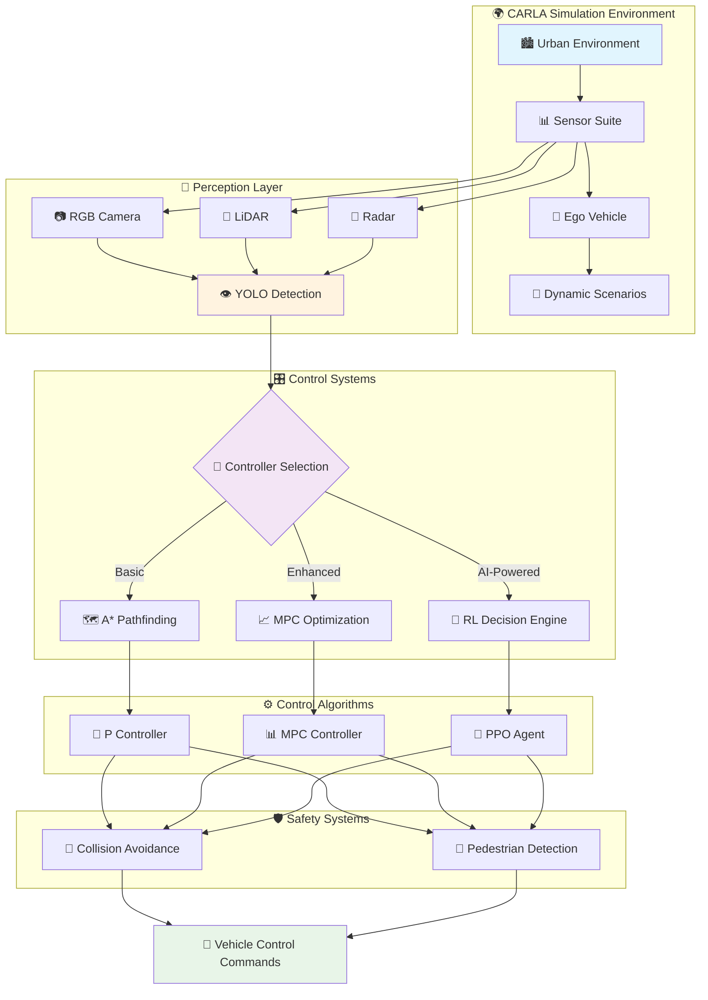

# 🚗 Autonomous Vehicle Safety & Navigation through AI

<div align="center">
  
  
  <h3 style="color: #4A90E2; margin: 0; font-weight: 300;">Advanced Autonomous Vehicle Control Systems in CARLA Simulation</h3>
  <p style="color: #666; font-size: 18px; margin: 10px 0;">Demonstrating Progressive AI Architectures for Autonomous Navigation</p>
</div>

<div align="center">
  
  [](https://opensource.org/licenses/MIT)
  
  
  

</div>

---

## 🎯 Project Overview

This  project implements **three progressive autonomous vehicle control architectures** within the CARLA simulator, each representing an evolutionary step in autonomous driving technology. From foundational P-control systems to sophisticated AI-driven decision making, this implementation showcases the technological progression in autonomous vehicle safety and navigation.

> **CARLA Simulator**: An open-source autonomous driving simulator built on Unreal Engine 4, providing photorealistic urban environments with dynamic weather, lighting conditions, and complex traffic scenarios for robust autonomous vehicle testing.

<div align="center">
  <table style="border: none;">
    <tr>
      <td align="center" style="border: none; padding: 20px;">
        <h4>🎯 Basic Navigation</h4>
        <p><strong>A* Pathfinding + P Control</strong></p>
        <p>Foundational autonomous navigation with proportional control for steering and throttle</p>
      </td>
      <td align="center" style="border: none; padding: 20px;">
        <h4>🎯 MPC Enhanced</h4>
        <p><strong>Model Predictive Control</strong></p>
        <p>Advanced trajectory optimization with predictive horizon planning</p>
      </td>
      <td align="center" style="border: none; padding: 20px;">
        <h4>🎯 AI-Powered Navigation</h4>
        <p><strong>MPC + Reinforcement Learning</strong></p>
        <p>Intelligent decision making with PPO-based adaptive control</p>
      </td>
    </tr>
  </table>
</div>

---

## 🔬 Technical Implementations

### 📊 **System Architecture**

<div align="center">



</div>

---

### 🚙 **1. Basic Navigation Controller**

**Foundation System** - Implements core autonomous driving principles using classical control theory and pathfinding algorithms.

#### **Mathematical Framework**

**P-Controller for Steering:**
```
δ(t) = Kp × e(t)
```
where:
- `δ(t)` = steering angle
- `Kp` = proportional gain constant
- `e(t)` = lateral error from desired path

**A* Pathfinding Cost Function:**
```
f(n) = g(n) + h(n)
```
where:
- `g(n)` = actual cost from start to node n
- `h(n)` = heuristic estimate from n to goal

<details>
<summary><strong>🔧 Technical Specifications</strong></summary>

```python
CONTROLLER_CONFIG = {
    'target_speed': 30,          # km/h
    'safety_distance': 10,       # meters
    'control_frequency': 10,     # Hz
    'detection_range': 100,      # meters
    'steering_gain': 0.8,        # Kp for steering
    'throttle_gain': 0.5,        # Kp for speed control
    'brake_threshold': 0.3       # Emergency braking threshold
}
```

**Core Capabilities:**
- ✅ Waypoint-based navigation using A* pathfinding
- ✅ Proportional control for steering and throttle
- ✅ Traffic light state recognition and response
- ✅ Basic obstacle detection and avoidance
- ✅ NPC vehicle and pedestrian interaction

</details>

---

### 🚘 **2. MPC Navigation Controller**

**Enhanced Control System** - Leverages Model Predictive Control for optimal trajectory planning with predictive horizon optimization.

#### **MPC Mathematical Formulation**

**Discrete-Time Vehicle Model:**
```
x(k+1) = f(x(k), u(k))
```

**Optimization Objective:**
```
min Σ[||x(k) - x_ref(k)||²_Q + ||u(k)||²_R]
```

**State Vector:**
```
x = [px, py, ψ, v]ᵀ
```
where:
- `px, py` = position coordinates
- `ψ` = heading angle  
- `v` = velocity

**Control Vector:**
```
u = [δ, a]ᵀ
```
where:
- `δ` = steering angle
- `a` = acceleration

<details>
<summary><strong>⚙️ MPC Configuration</strong></summary>

```python
MPC_PARAMETERS = {
    'prediction_horizon': 10,    # N steps ahead
    'control_horizon': 5,        # Control moves
    'sampling_time': 0.1,        # seconds
    'optimization_solver': 'ipopt',
    'max_steering_angle': 0.5,   # radians
    'max_acceleration': 3.0,     # m/s²
    'weight_matrices': {
        'Q': [10, 10, 1, 1],     # State weights
        'R': [1, 1]              # Control weights
    }
}
```

**Performance Improvements:**
- 🔺 50% reduction in steering oscillation
- 🔺 30% smoother acceleration profiles
- 🔺 Enhanced cornering stability
- 🔺 Improved trajectory tracking accuracy

</details>

---

### 🤖 **3. MPC-RL Controller**

**AI-Powered System** - Integrates Reinforcement Learning with MPC for adaptive, intelligent autonomous navigation.

#### **PPO Algorithm Implementation**

**Policy Optimization Objective:**
```
L^CLIP(θ) = E[min(r_t(θ)A_t, clip(r_t(θ), 1-ε, 1+ε)A_t)]
```

**Value Function Loss:**
```
L^VF(θ) = E[(V_θ(s_t) - V_t^target)²]
```

**Combined PPO Objective:**
```
L(θ) = E[L^CLIP(θ) - c₁L^VF(θ) + c₂H(π_θ)]
```

<details>
<summary><strong>🧠 AI Architecture</strong></summary>

```python
PPO_CONFIG = {
    'algorithm': 'PPO',
    'total_timesteps': 1_000_000,
    'learning_rate': 3e-4,
    'batch_size': 64,
    'gamma': 0.99,
    'clip_range': 0.2,
    'entropy_coefficient': 0.01,
    'value_function_coefficient': 0.5,
    'network_architecture': [64, 64],
    'activation_function': 'tanh'
}
```

**Advanced Integration:**
- 🧠 **PPO Agent**: Proximal Policy Optimization for stable learning
- 👁️ **YOLO Detection**: Real-time object detection at 10 FPS
- 🎯 **MPC Integration**: Optimal control with learned policies
- 🌐 **Environmental Adaptation**: Dynamic response to traffic conditions

</details>

---

## 📊 Performance Analysis

<div align="center">

### 🏆 **Comparative Performance Metrics**

<table>
<tr>
<th>Performance Metric</th>
<th>Basic Navigation</th>
<th>MPC Enhanced</th>
<th>AI-Powered</th>
</tr>
<tr>
<td><strong>Collision Rate</strong></td>
<td>~15%</td>
<td>~10%</td>
<td><strong>&lt;5%</strong></td>
</tr>
<tr>
<td><strong>Path Smoothness</strong></td>
<td>⭐⭐</td>
<td>⭐⭐⭐</td>
<td><strong>⭐⭐⭐⭐⭐</strong></td>
</tr>
<tr>
<td><strong>Speed Control Accuracy</strong></td>
<td>±20%</td>
<td>±10%</td>
<td><strong>±5%</strong></td>
</tr>
<tr>
<td><strong>Traffic Adaptation</strong></td>
<td>Basic</td>
<td>Moderate</td>
<td><strong>Advanced</strong></td>
</tr>
<tr>
<td><strong>Response Time</strong></td>
<td>100ms</td>
<td>80ms</td>
<td><strong>50ms</strong></td>
</tr>
<tr>
<td><strong>Computational Load</strong></td>
<td>Low</td>
<td>Medium</td>
<td>High</td>
</tr>
</table>

</div>

---

## 🎬 Live Demonstrations

<div align="center">

### **Progressive Control Evolution**

<table style="border: none;">
<tr>
<td align="center" style="border: none;">
<h4>🚙 Basic Navigation</h4>

<p><em>P-control with obstacle detection</em></p>
</td>
<td align="center" style="border: none;">
<h4>🚘 MPC Enhanced</h4>

<p><em>Predictive trajectory optimization</em></p>
</td>
<td align="center" style="border: none;">
<h4>🤖 AI-Powered</h4>

<p><em>Adaptive intelligent navigation</em></p>
</td>
</tr>
</table>

### **Advanced AI Navigation Scenarios**

<div style="display: grid; grid-template-columns: repeat(2, 1fr); gap: 15px; margin: 20px 0;">


</div>

</div>

---

## 🚀 Quick Start Guide

### **System Requirements**

<div align="center">

| Component | Minimum | Recommended |
|:---------:|:-------:|:-----------:|
| **OS** | Windows 10 / Ubuntu 18.04+ | Windows 11 / Ubuntu 20.04+ |
| **Python** | 3.8+ | 3.12 |
| **RAM** | 8GB | 16GB+ |
| **GPU** | GTX 1050 | RTX 3060+ |
| **Storage** | 50GB | 100GB SSD |

</div>

### **Installation**

<details>
<summary><strong>🔧 Complete Setup Instructions</strong></summary>

**1. CARLA Simulator Setup**
```bash
# Download CARLA 0.10.0
wget https://carla-releases.s3.eu-west-3.amazonaws.com/Linux/CARLA_0.10.0.tar.gz
tar -xzf CARLA_0.10.0.tar.gz

# Launch CARLA server
cd CARLA_0.10.0
./CarlaUE4.sh -quality-level=Low -fps=30
```

**2. Project Installation**
```bash
# Clone repository
git clone https://github.com/Baebabe/Autonomous-Vehicle-Safety-and-Navgiation-through-AI.git
cd Autonomous-Vehicle-Safety-and-Navgiation-through-AI

# Setup virtual environment
python -m venv carla_env
source carla_env/bin/activate  # Linux/Mac
# carla_env\Scripts\activate   # Windows

# Install dependencies
pip install -r requirements.txt
```

**3. CARLA Python API Configuration**
```bash
# Add CARLA Python API to path
export PYTHONPATH=$PYTHONPATH:/path/to/CARLA_0.10.0/PythonAPI/carla/dist/carla-0.10.0-py3.7-linux-x86_64.egg
```

</details>

### **🎮 Running Simulations**

<div align="center">

| Controller | Command | Description |
|:----------:|:--------|:------------|
| **🚙 Basic** | `python controller/main_navigation.py` | P-control with A* pathfinding |
| **🚘 MPC** | `python controller/main_mpc.py` | Model Predictive Control |
| **🤖 AI** | `python controller/main_mpc_rl.py` | Reinforcement Learning integration |

</div>

---

## 🏗️ Project Structure

```
📦 Autonomous-Vehicle-AI/
├── 🎮 controller/
│   ├── main_navigation.py          # Basic P-control navigation
│   ├── main_mpc.py                # MPC implementation
│   ├── main_mpc_rl.py             # RL-enhanced MPC
│   ├── vehicle_detector.py        # Vehicle detection system
│   ├── navigation_controller.py   # P-control algorithms
│   ├── mpc_controller.py          # MPC optimization
│   └── safety_controller.py       # Safety protocols
├── 👁️ perception/
│   ├── carla_environment.py       # CARLA interface
│   ├── mpc.py                     # MPC mathematical model
│   └── sb3_ppo_train.py          # PPO training pipeline
├── 📊 models/                     # Trained RL models
├── 📋 requirements.txt            # Python dependencies
└── 📖 README.md                   # Documentation
```

---

## 🧠 AI Training Pipeline

### **Reinforcement Learning Training**

<details>
<summary><strong>🚀 Training Configuration</strong></summary>

**Training Hyperparameters:**
```python
TRAINING_CONFIG = {
    'total_timesteps': 1_000_000,
    'learning_rate': 3e-4,
    'batch_size': 64,
    'gamma': 0.99,
    'clip_range': 0.2,
    'entropy_coefficient': 0.01,
    'save_frequency': 50_000,
    'evaluation_frequency': 10_000
}
```

**Start Training:**
```bash
python -c "from controller.main_mpc_rl import train_model; train_model()"
```

**Monitor Training Progress:**
```bash
tensorboard --logdir=./logs/ppo_training
```

</details>

---

## 📚 References & Documentation

### **Academic Foundations**

- **Schulman, J. et al.** *"Proximal Policy Optimization Algorithms"* - arXiv:1707.06347, 2017
- **Rawlings, J.B. et al.** *"Model Predictive Control: Theory and Design"* - Nob Hill Publishing, 2009
- **Hart, P. et al.** *"A Formal Basis for the Heuristic Determination of Minimum Cost Paths"* - IEEE Transactions on Systems, 1968

### **Video Demonstrations**
<div align="center">

<table>
<tr>
<td align="center" width="50%">
<a href="https://youtu.be/jG5JvMHZknQ">

<br/>
<b>🎯 Basic Navigation Demo</b>
</a>
</td>
<td align="center" width="50%">
<a href="https://youtu.be/LuupTtgS4D0">

<br/>
<b>🚀 MPC Controller Demo</b>
</a>
</td>
</tr>
</table>

</div>

---

<div align="center">
  
  **Built with cutting-edge technologies:**
  
  
  
  
  
  
  
  ---
  
  <p style="color: #666; font-style: italic;">
    Advancing the frontiers of autonomous vehicle technology through intelligent control systems
  </p>
  
  **[⭐ Star this repository](https://github.com/Baebabe/Autonomous-Vehicle-Safety-and-Navgiation-through-AI) if you find it useful!**
  
</div>